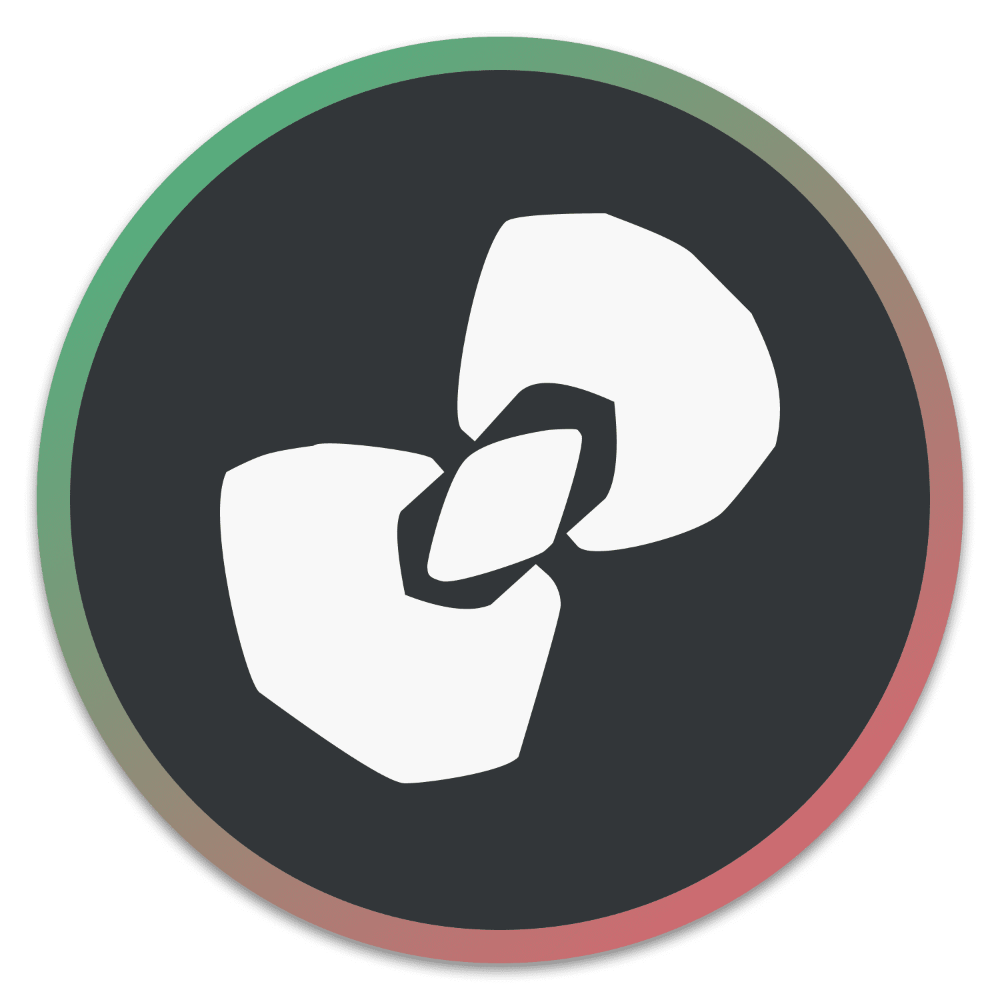
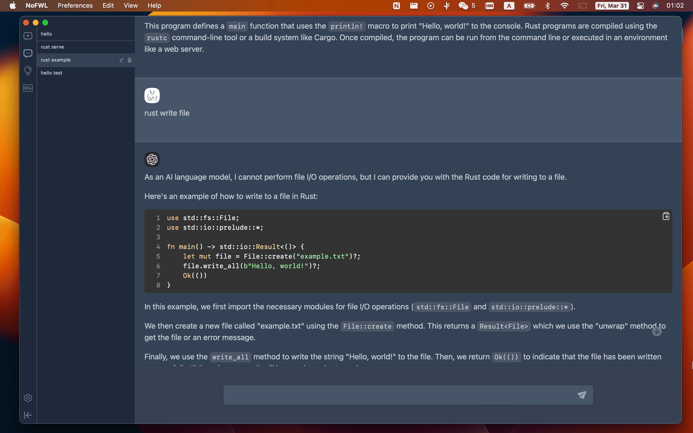

<p align="center">
  
  <h1 align="center">NoFWL</h1>
  <p align="center">NoFWL Desktop Application (Mac, Windows and Linux)</p>
</p>

<!---->

[](https://github.com/lencx/nofwl/releases)
[](https://twitter.com/lencx_)

<a href="https://www.buymeacoffee.com/lencx" target="_blank"></a>

Currently under active development, please be patient. Its development is inspired by [lencx/ChatGPT](https://github.com/lencx/ChatGPT), but NoFWL has more powerful features.


## Install

- [📝 Update Log](./UPDATE_LOG.md)
- [🕒 History versions...](https://github.com/lencx/nofwl/releases)

### Windows

[NoFWL_0.1.0_windows_x86_64.msi](https://github.com/lencx/nofwl/releases/download/v0.1.0/NoFWL_0.1.0_windows_x86_64.msi): Direct download installer

### macOS

- [NoFWL_0.1.0_macos_aarch64.dmg](https://github.com/lencx/nofwl/releases/download/v0.1.0/NoFWL_0.1.0_macos_aarch64.dmg): Direct download installer
- [NoFWL_0.1.0_macos_x86_64.dmg](https://github.com/lencx/nofwl/releases/download/v0.1.0/NoFWL_0.1.0_macos_x86_64.dmg): Direct download installer
- Homebrew \
  Or you can install with _[Homebrew](https://brew.sh) ([Cask](https://docs.brew.sh/Cask-Cookbook)):_
  ```sh
  brew tap lencx/nofwl
  brew install --cask nofwl --no-quarantine
  ```
  Also, if you keep a _[Brewfile](https://github.com/Homebrew/homebrew-bundle#usage)_, you can add something like this:
  ```rb
  repo = "lencx/nofwl"
  tap repo, "https://github.com/#{repo}.git"
  cask "nofwl", args: { "no-quarantine": true }
  ```


#### Developer cannot be verified?

[Open a Mac app from an unidentified developer](https://support.apple.com/en-sg/guide/mac-help/mh40616/mac)

#### Minimum supported system version

macOS 10.14.6+

#### macOS macos_xxx seems broken

If you encounter the error message "ChatGPT" is damaged and can't be opened. You should move it to the Trash. while installing software on macOS, it may be due to security settings restrictions in macOS. To solve this problem, please try the following command in Terminal:

```bash
xattr -cr /YOUR_PATH/NoFWL.app
```

### Linux

- [NoFWL_0.1.0_linux_x86_64.deb](https://github.com/lencx/nofwl/releases/download/v0.1.0/NoFWL_0.1.0_linux_x86_64.deb): Download `.deb` installer, advantage small size, disadvantage poor compatibility
- [NoFWL_0.1.0_linux_x86_64.AppImage.tar.gz](https://github.com/lencx/nofwl/releases/download/v0.1.0/NoFWL_0.1.0_linux_x86_64.AppImage.tar.gz): Works reliably, you can try it if `.deb` fails to run

## Features

- OpenAI API Key
- Themes (light, dark, system)
- Internationalization (English, Chinese)
- Safe and reliable, all data is stored locally

## I18N

If you would like to contribute translations for other languages to the application, you can check here.

[locales/{lang}.yml](./locales/README.md)

## TODO

- [ ] System Tray
- [ ] Export (PNG, Markdown, PDF)
- [ ] Slash commands
- [ ] Shortcut keys
- [ ] Prompts
  - [ ] Sync
  - [ ] Custom
- [ ] Plugins

## Preview





